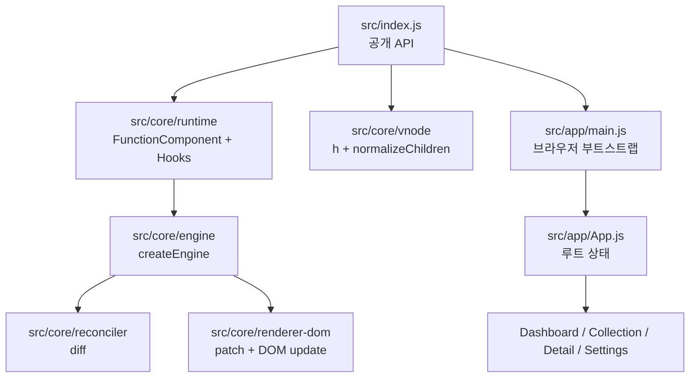
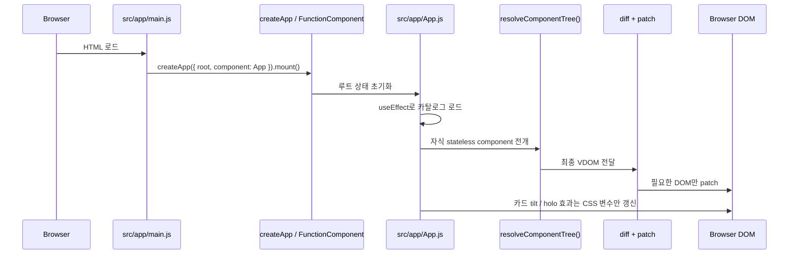

# Week5 React-like Runtime

week5 과제인 React의 `Component · State · Hooks` 포함한 미니 React를 구현하고, 포켓몬 공개 데이터를 활용해 `포켓몬 카드 컬렉션` 데모를 `단일 루트 기반 다중 페이지 SPA(Single Page Application)`으로 구현했습니다.

이 저장소의 장기 React 호환 문서는 [archive/v2](./archive/v2)에 보관했고, 현재 기준 문서는 week5 제출용 v3 문서입니다.

## 문서 안내

- 요구사항: [docs/requirements.md](./docs/requirements.md)
- 아키텍처: [docs/architecture.md](./docs/architecture.md)
- API 명세: [docs/api-spec.md](./docs/api-spec.md)
- 범위 요약: [docs/week5-scope.md](./docs/week5-scope.md)
- 시연 앱 기획: [docs/demo-app-plan.md](./docs/demo-app-plan.md)
- 클래스 다이어그램 및 구조도: [docs/class-and-structure-diagram.md](./docs/class-and-structure-diagram.md)
- 업데이트/스케줄링 흐름: [docs/update-flow-and-scheduling.md](./docs/update-flow-and-scheduling.md)
- 학습 문서: [learning-docs/overview.md](./learning-docs/overview.md)

## 한눈에 보기

- 라이브러리 핵심: `FunctionComponent`, 루트 전용 `useState / useEffect / useMemo`, `Virtual DOM + Diff + Patch`
- 현재 시연 앱: `Dashboard / Collection / Detail / Settings`
- 데이터 출처: `PokeAPI` + `official-artwork` 이미지
- 정규 전국도감 범위: `#001 ~ #1025`
- 현재 테스트 결과: `78 passed, 0 failed, 0 skipped`

## 앱 미리보기

| Dashboard | Collection |
|---|---|
|  |  |

| Detail | Settings |
|---|---|
|  |  |

## 이 프로젝트가 보여주는 것

이 프로젝트의 목적은 실제 React 전체를 복제하는 것이 아니라, week5 과제의 의도에 맞게 핵심 개념을 직접 구현하고 팀원 전체가 설명 가능한 형태로 이해하는 것을 목표로 했습니다.

- 함수형 컴포넌트
- `hooks`
- `useState`, `useEffect`, `useMemo`
- Virtual DOM + Diff + Patch
- 브라우저에서 동작하는 상호작용 데모

현재 앱은 단순 예제가 아니라, 외부 데이터를 불러오고 여러 화면이 상태를 공유하는 카드 쇼케이스 서비스로 구성되어 있습니다.

## 과제 요구와 현재 앱의 연결

과제에서 요구하는 핵심 요소가 앱에서 어떻게 사용되는지는 아래와 같습니다.

- `Component`
  - 페이지 컴포넌트와 공통 UI 컴포넌트를 분리했습니다.
  - 예: [src/app/pages/DashboardPage.js](./src/app/pages/DashboardPage.js), [src/app/components/CardTile.js](./src/app/components/CardTile.js)
- `State`
  - 모든 상태는 루트 [src/app/App.js](./src/app/App.js)에 있습니다.
  - 예: `currentPage`, `cards`, `selectedCardId`, `settings`, `searchKeyword`
- `Hooks`
  - `useState`: 페이지 전환, 카드 목록, 설정, 필터, 즐겨찾기 상태
  - `useEffect`: 문서 제목 변경, 카드 데이터 로딩, 상세 데이터 로딩, localStorage 저장
  - `useMemo`: 필터/정렬 결과, KPI 수치, 선택 카드, 타입 요약
- `Virtual DOM + Diff + Patch`
  - `setState` 이후 루트 컴포넌트를 다시 실행하고, 이전/다음 VDOM을 비교해 필요한 DOM만 갱신합니다.
- `실제 브라우저 상호작용`
  - 카드 검색, 타입 필터, 정렬, 즐겨찾기 토글, 페이지 전환, 설정 변경이 모두 동작합니다.

## 시스템 구조



핵심 포인트:

- [src/index.js](./src/index.js)는 라이브러리의 정문입니다.
- [src/core/runtime](./src/core/runtime)은 Hook과 렌더 사이클을 관리합니다.
- [src/core/reconciler](./src/core/reconciler)는 변경 사항을 계산합니다.
- [src/core/renderer-dom](./src/core/renderer-dom)은 실제 DOM을 수정합니다.
- [src/app](./src/app)은 이 라이브러리 위에 만든 시연 앱입니다.

## 앱 데이터 흐름



## 상태와 카드 인터랙션 분리

이 프로젝트의 중요한 설계 포인트는 `상태 기반 렌더링`과 `고빈도 카드 효과`를 분리했다는 점입니다.

### 루트 상태가 담당하는 것

- 페이지 전환
- 카드 목록
- 검색/필터/정렬
- 선택 카드
- 즐겨찾기
- 설정 반영
- 로딩/오류 상태

### 카드 DOM 효과가 담당하는 것

- 카드 기울기
- 홀로그램 표면 이동
- 스파클/글로우 효과
- 마우스 이탈 시 복귀

즉, 데이터와 UI 구조 변화는 React-like 런타임이 처리하고, 마우스 이동 같은 초고빈도 효과는 카드 DOM 스타일만 직접 바꿔 성능을 지킵니다.

## 현재 앱 구조

- 공개 API 엔트리포인트: [src/index.js](./src/index.js)
- 브라우저 데모 엔트리포인트: [src/app/main.js](./src/app/main.js)
- 루트 앱: [src/app/App.js](./src/app/App.js)
- HTML 셸: [index.html](./index.html)

주요 앱 구성:

- 공통 셸: [src/app/components/AppShell.js](./src/app/components/AppShell.js)
- 컬렉션 카드: [src/app/components/CardTile.js](./src/app/components/CardTile.js)
- 상세 카드 프리뷰: [src/app/components/CardShowcase.js](./src/app/components/CardShowcase.js)
- 원격 데이터 로더: [src/app/data/pokeApiClient.js](./src/app/data/pokeApiClient.js)
- fallback 데이터: [src/app/data/cardLibrary.js](./src/app/data/cardLibrary.js)

현재 앱은 아래 시연용 보강도 포함합니다.

- Collection은 전국도감 `#001 ~ #1025` shell 카드를 먼저 고정 순서로 유지하고, 가상 스크롤 방식으로 화면 근처 카드만 DOM에 렌더합니다.
- 원격 카탈로그는 shell 카드를 먼저 준비한 뒤, 현재 보이는 구간의 타입/스탯 정보를 점진 hydrate 합니다.
- 타입 필터를 적용하면 필요한 타입 데이터를 전체 기준으로 확보한 뒤 결과를 보여주며, 이 동안에는 로딩 상태를 명시적으로 표시합니다.
- 앱 UI는 `English / 한국어 / 日本語 / 中文 / Español`을 지원하고, 저장된 설정이 없으면 브라우저 언어를 기준으로 기본 locale을 고릅니다.
- 포켓몬 표시 이름은 로컬 이름 사전을 우선 사용하고, 사전에 없는 번호만 `pokemon-species`로 예외 보강합니다.
- Collection의 타입 배지는 18개 타입 전체에 대해 공식 포켓몬 타입 팔레트 톤을 반영합니다.
- Collection 가상 스크롤에서는 함수형 자식 `key` 보존과 patch 순서 보정을 통해 카드 타입 배지가 섞이지 않도록 안정화했습니다.
- Detail은 메인 쇼케이스 카드 아래에 `Game Sprite` 비교 카드를 함께 보여줍니다.
- Detail의 연관 포켓몬은 같은 진화트리를 먼저 보여주고, 부족한 칸은 같은 타입과 유사한 종족값 카드로 보강합니다.
- 데스크톱에서는 `Render / Patch Inspector`로 렌더/patch를 시각화하고, 모바일에서는 화면을 비우기 위해 숨깁니다.

## 데이터와 이미지 출처

현재 카드 데이터와 이미지는 아래 공개 소스를 사용합니다.

- 데이터: `PokeAPI` `https://pokeapi.co/api/v2/...`
- 이미지: `PokeAPI sprites`의 `official-artwork` 및 기본 sprite
- 포켓몬 다국어 표시 이름: 앱 내부 로컬 이름 사전 + `pokemon-species` 예외 fallback

정규 전국도감 기준으로 `#001 ~ #1025`까지만 카탈로그에 포함합니다. 이 범위를 넘어가는 엔트리는 시연 앱에서 제외합니다.

원격 로드가 실패하면:

- 마지막 성공 캐시가 있으면 캐시를 사용하고
- 없으면 [src/app/data/cardLibrary.js](./src/app/data/cardLibrary.js)의 fallback 카드로 내려갑니다.

초기 진입 성능을 위해 원격 카탈로그는 아래 순서로 처리합니다.

- 먼저 `#001 ~ #1025` shell 카드를 고정 순서로 준비
- 이어서 현재 보이는 구간의 타입/스탯 정보만 순차 hydrate
- 타입 필터 사용 시에는 전체 타입 데이터를 먼저 로드한 뒤 결과를 표시
- 실패 시 캐시 또는 fallback 카드로 안전하게 복귀

## 실제 React와의 공통점

- 함수형 컴포넌트로 UI를 선언합니다.
- 상태가 바뀌면 다시 렌더링됩니다.
- Hook 호출 순서에 따라 상태를 유지합니다.
- Virtual DOM을 만든 뒤 이전 트리와 비교해 필요한 DOM만 갱신합니다.
- `useEffect`로 렌더 이후 부수 효과를 처리하고, `useMemo`로 파생 계산을 캐시합니다.

## 실제 React와의 차이점

- 상태와 Hook은 루트 컴포넌트에서만 사용합니다.
- 자식 컴포넌트는 상태 없는 pure function입니다.
- Context, Ref, Suspense, Portal, SSR 같은 고급 기능은 제외합니다.
- 공개 API 호환보다 구조 이해와 과제 설명 가능성을 우선합니다.

## 테스트 전략과 결과

단위 테스트:

- Hook 슬롯 재사용
- `useState`, `useEffect`, `useMemo`
- diff / patch
- form semantics
- inspect/runtime 동작
- PokeAPI 카탈로그 정규 범위 제한

기능 테스트:

- 앱 최초 렌더
- 컬렉션 검색/선택
- 즐겨찾기 반영
- 설정 즉시 반영
- 원격 카탈로그 fallback 안내
- Inspector와 이미지 src patch 시각화
- 컬렉션 가상 스크롤 렌더링

현재 테스트 결과:

- `78 passed, 0 failed, 0 skipped`

## 실행 방법

기본 검증 명령:

```bash
npm test
```

```bash
npm run build
```

브라우저 데모 기준:

- HTML 셸은 [index.html](./index.html)입니다.
- 루트 DOM은 `<div id="app"></div>`입니다.
- 앱 엔트리포인트는 [src/app/main.js](./src/app/main.js)입니다.
- `src/app/main.js`는 `document.getElementById("app")`로 root를 찾고 mount 합니다.

정적 서버를 사용해 [index.html](./index.html)을 열면 현재 카드 쇼케이스 앱을 브라우저에서 확인할 수 있습니다.

## 현재 상태 요약

현재 구현은 v3 문서의 취지에 맞게 작성되어 있습니다.

- 단일 루트 엔트리 기반 상태 기반 다중 페이지 SPA
- 루트 상태 기반 데이터 흐름
- 자식 stateless component 구조
- `useState`, `useEffect`, `useMemo` 실사용
- 외부 데이터 로딩과 fallback 처리
- 브라우저 시연 가능
- 테스트와 빌드 통과

남은 작업은 구조를 바꾸는 것이 아니라, 시각 완성도를 더 다듬는 수준입니다.
