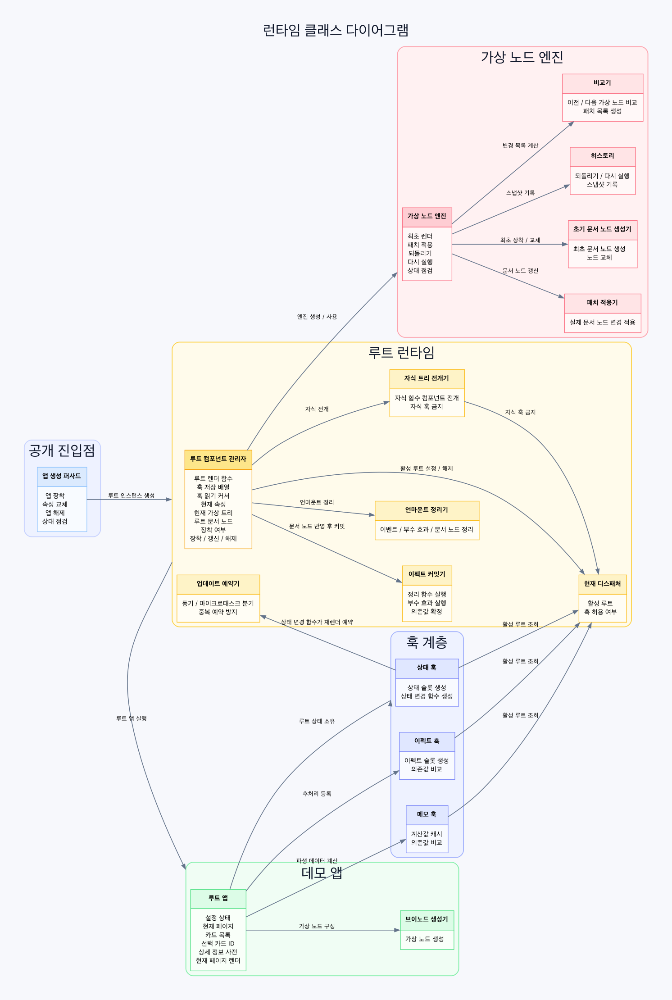
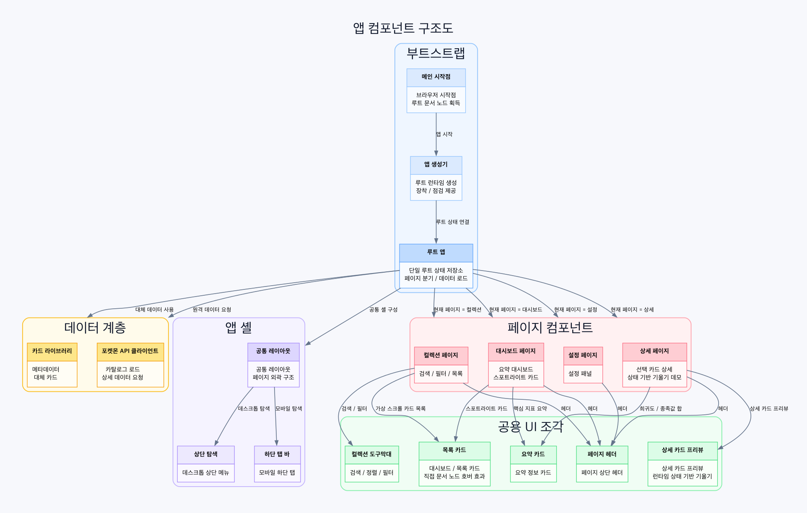

# 클래스 다이어그램 및 컴포넌트 구조도

## 1. 문서 목적

본 문서는 현재 week5 v3 프로젝트의 실제 코드 구조를 기준으로,

- 런타임 핵심 클래스와 모듈의 연결 관계
- 시연 앱 컴포넌트의 연결 구조
- 실제 React와 비교했을 때의 구현 차이

를 한 번에 설명하기 위한 보조 문서다.

## 2. 먼저 알아둘 점

이 프로젝트는 일반적인 React 애플리케이션이 아니라, `src/core`에 직접 구현한 `React-like Runtime` 위에서 `src/app` 데모 앱이 동작하는 구조다.

또한 서비스 코드 기준으로 명시적인 `class`는 사실상 `FunctionComponent` 하나뿐이다.
그 외의 구성 요소는 다음 두 범주로 나뉜다.

- 함수형 컴포넌트
- 역할별 모듈 함수

즉, 아래 다이어그램의 `classDiagram`은 전통적인 OOP 클래스만이 아니라, 발표와 구조 이해를 위해 "핵심 런타임 단위"를 함께 묶어 표현한 것이다.

## 3. 상위 구조 요약

프로젝트의 큰 흐름은 다음과 같다.

1. `src/app/main.js`가 브라우저에서 앱을 시작한다.
2. `createApp()`이 루트 `FunctionComponent` 인스턴스를 만든다.
3. `FunctionComponent`가 루트 `App` 함수를 실행한다.
4. `App`과 자식 함수형 컴포넌트들이 `h()`로 VNode를 만든다.
5. `resolveComponentTree()`가 자식 함수형 컴포넌트를 실제 VNode 트리로 전개한다.
6. `createEngine()`이 최초 DOM 렌더 또는 diff/patch 기반 DOM 갱신을 수행한다.
7. `useEffect`로 수집된 effect는 DOM 반영 이후 commit 된다.

## 4. 런타임 클래스 다이어그램

아래 이미지는 문서 뷰어에서 더 안정적으로 보이도록 PNG로 함께 저장한 버전이다.

원본 그래프 소스는 `docs/assets/runtime-class-diagram.dot`에 있다.

## 5. 앱 컴포넌트 연결 구조도

아래 이미지는 앱 계층의 실제 연결 관계를 PNG로 저장한 버전이다.

원본 그래프 소스는 `docs/assets/app-structure-diagram.dot`에 있다.

## 6. 핵심 구조 해설

### 6.1 `FunctionComponent`가 런타임의 중심이다

이 프로젝트에서 루트 컴포넌트의 상태 저장소, Hook 슬롯, 렌더 사이클, effect commit, unmount cleanup은 모두 `FunctionComponent`가 관리한다.

즉, 실제 React의 Fiber + 컴포넌트 인스턴스 분산 구조 대신,
이 프로젝트는 `루트 하나를 관리하는 런타임 관리자 클래스`를 중심으로 설계되어 있다.

### 6.2 `App`이 모든 상태를 소유한다

데모 앱의 상태는 모두 `src/app/App.js`에 있다.

대표 상태:

- `currentPage`
- `cards`
- `selectedCardId`
- `settings`
- `searchKeyword`
- `typeFilter`
- `favoritesOnly`
- `sortMode`
- `detailById`

페이지 컴포넌트와 공용 컴포넌트는 이 상태를 직접 가지지 않고 `props`만 받아 렌더링한다.

### 6.3 자식 함수형 컴포넌트는 stateless renderer다

`resolveComponentTree()`는 `h(Child, props)` 형태의 자식 함수를 즉시 실행해 일반 VNode로 바꾼다.

이 과정에서 child component는 독립 Hook 저장소를 가지지 않으며,
resolver 단계에서는 Hook 사용 자체가 금지된다.

따라서 이 프로젝트의 자식 컴포넌트는 실제 React의 독립 상태 컴포넌트라기보다,
`props -> VNode`를 반환하는 순수 렌더 함수에 가깝다.

### 6.4 엔진 계층은 `diff -> patch -> DOM`으로 이어진다

렌더 결과는 VNode 트리로 만들어진 뒤 엔진으로 전달된다.

- 최초 mount: `createDomFromVNode()`로 DOM 전체 생성
- update: `diff()`로 patch 목록 계산
- commit: `applyPatches()`로 실제 DOM 변경

이 구조 덕분에 앱 계층과 DOM 반영 계층이 분리된다.

## 7. 실제 React와 어떻게 다른가

### 7.1 상태와 Hook이 루트에만 있다

실제 React는 각 함수형 컴포넌트가 자신의 state와 Hook 체인을 가질 수 있다.
하지만 이 프로젝트에서는 루트 `App`만 Hook을 사용하고, 자식은 Hook을 사용할 수 없다.

즉, 상태 소유권이 `루트 한 곳`으로 강하게 제한된다.

실제 코드 기준으로는 `FunctionComponent` 인스턴스가 단 하나의 `hooks[]` 배열을 소유하고,
루트 `App` 렌더 동안에만 `currentDispatcher`가 Hook 사용을 허용한다.
반대로 자식 함수형 컴포넌트는 `resolveComponentTree()`에서 Hook 비허용 상태로 실행된다.

이 차이 때문에 실제 React에서는 가능한 아래 패턴이 여기서는 불가능하거나 의도적으로 금지된다.

- 자식 컴포넌트 내부 `useState`
- 자식 컴포넌트 내부 `useEffect`
- 컴포넌트별 로컬 상태 캡슐화
- 동일 자식 컴포넌트의 여러 인스턴스가 각자 독립 상태를 가지는 구조

즉, 이 프로젝트는 React의 `state is local to each component instance` 모델이 아니라,
`all state lives in the single root app` 모델을 채택한다.

### 7.2 자식 컴포넌트는 Fiber 단위가 아니다

실제 React는 각 컴포넌트가 Fiber 노드 수준에서 추적되며,
컴포넌트 경계 단위로 reconciliation이 이뤄진다.

반면 이 프로젝트는 자식 함수형 컴포넌트를 먼저 실행해 일반 VNode로 평탄화한 뒤 diff를 수행한다.
즉, diff의 대상은 "컴포넌트 트리"라기보다 "해석이 끝난 VNode 트리"다.

이 차이는 내부 동작을 꽤 크게 바꾼다.

- 실제 React는 컴포넌트 경계마다 작업 단위를 가진다.
- 이 프로젝트는 자식을 먼저 실행해 "결과물 VNode"로 바꾼 뒤 비교한다.
- 따라서 자식 컴포넌트 자체의 생명주기나 개별 인스턴스 identity가 약하다.
- diff는 함수 컴포넌트를 이해하는 것이 아니라, 이미 확정된 일반 노드 구조를 비교한다.

발표 관점에서는 이것을 "컴포넌트 기반 렌더링은 맞지만, reconciliation의 기준점은 실제 React보다 더 평면적이다"라고 설명하면 정확하다.

### 7.3 스케줄러가 매우 단순하다

실제 React는 우선순위, interruptible rendering, concurrent features 같은 복잡한 스케줄링 개념을 가진다.
이 프로젝트는 `sync` 또는 `microtask batching` 정도만 지원하는 단순한 업데이트 예약 방식을 쓴다.

즉, 복잡한 동시성 모델은 없다.

조금 더 구체적으로 보면 다음이 없다.

- lane priority
- transition 우선순위
- render 중단과 재개
- background rendering
- time slicing
- selective hydration

대신 이 프로젝트의 상태 변경은 결국 `component.update()`를 다시 호출하는 방향으로 이어진다.
즉, 업데이트 모델이 명확하고 설명하기 쉽지만, 실제 React처럼 큰 트리에서 세밀하게 작업을 나누지는 않는다.

### 7.4 effect 모델이 단순화되어 있다

실제 React는 `useEffect`, `useLayoutEffect`, Strict Mode 재실행, 개발 모드 검증 등 다양한 실행 규칙이 있다.
이 프로젝트는 렌더 중 effect 인덱스를 모았다가 DOM 반영 뒤 `commitEffects()`에서 순서대로 실행하는 단순 모델이다.

즉, effect 단계는 있지만 React 전체 규칙을 완전히 재현하지는 않는다.

차이를 더 세밀하게 나누면 다음과 같다.

- `useLayoutEffect`가 없다.
- Strict Mode의 double invoke 같은 개발 검증 흐름이 없다.
- mount와 update 시 effect 타이밍 구분이 훨씬 단순하다.
- cleanup 정책도 root 중심의 단순한 순차 처리다.
- effect flush 우선순위나 분할 실행 같은 개념이 없다.

그래서 이 구현은 "`effect는 DOM 이후 실행된다`"라는 핵심 개념은 보여주지만,
실제 React effect 시스템의 모든 미묘한 규칙을 복제하지는 않는다.

### 7.5 이벤트 시스템이 다르다

실제 React는 Synthetic Event 시스템과 이벤트 위임 계층을 사용한다.
이 프로젝트는 patch 단계에서 DOM 노드에 직접 이벤트 핸들러를 설정하거나 제거한다.

즉, 이벤트 추상화 계층이 훨씬 얇다.

이 차이로 인해 얻는 장단점도 분명하다.

- 장점: 구현이 직관적이고 디버깅이 쉽다.
- 장점: DOM 이벤트와 코드 연결 관계가 직접적이다.
- 단점: React의 이벤트 정규화 계층이 없다.
- 단점: 캡처링/버블링 추상화, SyntheticEvent 재사용 정책 같은 부가 모델이 없다.
- 단점: 프레임워크 차원의 이벤트 최적화 여지가 작다.

### 7.6 지원 범위가 의도적으로 작다

실제 React에는 아래 개념들이 넓게 존재한다.

- Context
- Ref
- Suspense
- Error Boundary
- Portal
- SSR hydration
- Concurrent rendering

현재 프로젝트는 week5 과제 범위에 맞춰,
`함수형 컴포넌트 + 루트 상태 + useState/useEffect/useMemo + VDOM diff/patch`에 집중한 축소 구현이다.

즉, 이 프로젝트의 목표는 "React와 완전히 같은 앱 프레임워크 만들기"가 아니라,
"React의 핵심 개념 몇 가지를 직접 구현해 설명 가능하게 만들기"다.

### 7.7 상태 업데이트 전파 방식도 더 직접적이다

실제 React는 상태 업데이트가 Fiber 트리와 scheduler를 거치며, 어떤 서브트리를 다시 계산할지 프레임워크가 결정한다.
이 프로젝트에서는 `useState` setter가 슬롯 값을 바꾸고 `scheduleUpdate(component)`를 호출하면,
결국 루트 `FunctionComponent.update()`가 다시 수행된다.

즉, 상태 변경의 전파 경로가 아래처럼 매우 짧다.

1. setter 호출
2. Hook slot 값 변경
3. 루트 update 예약
4. 루트 `App` 재실행
5. 자식 함수형 컴포넌트 재전개
6. VNode diff
7. DOM patch

이 흐름은 학습에는 매우 좋지만,
실제 React처럼 복잡한 부분 렌더 최적화나 다양한 우선순위 제어를 제공하지는 않는다.

### 7.8 이 프로젝트는 "학습용 런타임"에 더 가깝다

결국 가장 중요한 차이는 목표 그 자체다.

- React는 범용 UI 프레임워크다.
- 이 프로젝트는 week5 과제 요구를 만족하기 위한 React-like runtime이다.
- React는 수많은 edge case와 생태계 요구를 품는다.
- 이 프로젝트는 발표 가능성, 구조 설명 가능성, 테스트 가능성을 우선한다.

그래서 "무엇이 빠졌는가"만 보기보다,
"왜 여기서는 일부러 단순화했는가"를 함께 설명해야 이 구현의 의도가 정확하게 전달된다.

## 8. 발표 때 강조하면 좋은 문장

- 이 프로젝트는 "React를 완전히 복제"한 것이 아니라, 과제의 핵심 개념이 어떻게 동작하는지를 설명 가능한 구조로 재구성한 React-like Runtime이다.
- 실제 React와 가장 큰 차이는 `모든 상태가 루트에만 있고, 자식은 stateless renderer`라는 점이다.
- 따라서 이 구현은 React의 전체 범용 프레임워크라기보다, `Component + State + Hooks + VDOM + Diff + Patch`를 학습용으로 분해해 보여주는 엔진에 가깝다.
