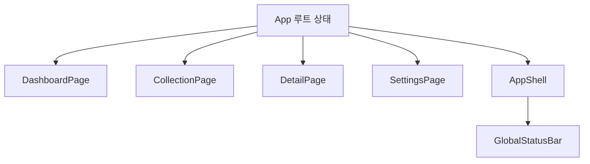

# 카드 컬렉션 쇼케이스 앱 설명

## 1. 이 앱은 무엇을 보여주기 위한가

현재 앱은 v3 라이브러리가 실제 화면 변화에 어떻게 쓰이는지 보여주는 시연용 앱이다.

앱 목표는 두 가지다.

- 보는 사람이 재미를 느끼게 한다.
- 동시에 라이브러리의 상태 관리, 렌더링, 페이지 전환을 분명하게 보여준다.

즉, 이 앱은 “예쁜 카드 데모”이면서 동시에 “라이브러리 검증용 앱”이다.

## 2. 앱의 전체 구조

주요 파일:

- [src/app/App.js](../src/app/App.js)
- [src/app/main.js](../src/app/main.js)
- [src/app/data/pokeApiClient.js](../src/app/data/pokeApiClient.js)
- [src/app/data/cardLibrary.js](../src/app/data/cardLibrary.js)
- [src/app/components](../src/app/components)
- [src/app/pages](../src/app/pages)

앱은 아래 4개 페이지로 구성된다.

- `dashboard`
- `collection`
- `detail`
- `settings`

하지만 실제로는 HTML 파일이 여러 개가 아니다.

하나의 루트 앱 안에서 `currentPage` 상태만 바꿔 여러 페이지처럼 보이게 한다.

## 3. 루트 상태는 어디에 있는가

모든 핵심 상태는 [src/app/App.js](../src/app/App.js)에 있다.

대표 상태:

- `currentPage`
- `cards`
- `isLoading`
- `loadError`
- `selectedCardId`
- `searchKeyword`
- `typeFilter`
- `favoritesOnly`
- `sortMode`
- `lastAction`
- `settings`

이것이 중요한 이유는, 상위 v3 문서가 “루트만 상태를 가진다”는 규칙을 강제하기 때문이다.

## 4. 앱 데이터 흐름

즉, 하나의 루트 상태가 여러 페이지와 공통 셸에 동시에 전달된다.

예를 들어 `lastAction`이 바뀌면:

- 상단 상태 배너
- 대시보드 최근 액션
- 상세 페이지 이동 흐름

같은 여러 부분이 함께 영향을 받을 수 있다.

## 5. 페이지별 역할

### 5.1 대시보드

파일:

- [src/app/pages/DashboardPage.js](../src/app/pages/DashboardPage.js)

하는 일:

- 전체 카드 수 요약
- 즐겨찾기 수 요약
- 현재 보이는 카드 수 요약
- 선택된 카드 요약
- Spotlight 카드 표시
- 타입 요약 표시

즉, “지금 상태가 어떤가”를 보여주는 요약 페이지다.

### 5.2 컬렉션

파일:

- [src/app/pages/CollectionPage.js](../src/app/pages/CollectionPage.js)
- [src/app/components/CollectionToolbar.js](../src/app/components/CollectionToolbar.js)
- [src/app/components/CardTile.js](../src/app/components/CardTile.js)

하는 일:

- 검색
- 타입 필터
- 즐겨찾기 필터
- 정렬
- 카드 선택
- 즐겨찾기 토글

즉, 사용자가 가장 많이 상호작용하는 작업 중심 페이지다.

### 5.3 상세

파일:

- [src/app/pages/DetailPage.js](../src/app/pages/DetailPage.js)
- [src/app/components/CardShowcase.js](../src/app/components/CardShowcase.js)

하는 일:

- 선택된 카드 크게 표시
- 타입, 번호, 높이, 무게, 설명 표시
- 종족값 6종과 Base Stat Total 표시
- 즐겨찾기 토글
- 관련 카드 이동
- 다음 카드 이동

즉, “선택된 카드 한 장”에 집중하는 페이지다.

### 5.4 설정

파일:

- [src/app/pages/SettingsPage.js](../src/app/pages/SettingsPage.js)

하는 일:

- 기본 시작 페이지 선택
- 기본 정렬 선택
- tilt on/off
- glare on/off
- 고해상도 이미지 on/off
- 데모 리셋

즉, 전역 표현 정책을 바꾸는 페이지다.

## 6. 외부 이미지와 데이터

파일:

- [src/app/data/pokeApiClient.js](../src/app/data/pokeApiClient.js)
- [src/app/data/cardLibrary.js](../src/app/data/cardLibrary.js)

현재 앱은 원격 카탈로그를 기본 데이터 소스로 사용하고, 실패 시 fallback 카드 메타데이터로 내려간다.

각 카드가 가지는 대표 정보:

- `id`
- `name`
- `number`
- `imageUrl`
- `thumbUrl`
- `types`
- `rarity`
- `height`
- `weight`
- `baseStats`
- `flavor`
- `isFavorite`

즉, 카드 하나가 곧 앱이 렌더링하는 기본 데이터 단위다.

추가로 현재 구현은 아래 정책을 따른다.

- 원격 데이터: `PokeAPI`
- 이미지: `official-artwork`와 기본 sprite
- 정규 전국도감 범위: `#001 ~ #1025`
- 원격 실패 시: `cardLibrary` fallback 사용

## 7. 왜 3D 틸트를 상태로 관리하지 않았는가

이 부분이 매우 중요하다.

카드 틸트는 마우스가 움직일 때마다 계속 변한다.
이걸 루트 `useState`에 넣으면 너무 자주 전체 렌더가 일어날 수 있다.

그래서 현재 앱은 아래처럼 역할을 분리했다.

- 상태 기반 렌더러가 담당하는 것
  - 카드 선택
  - 페이지 전환
  - 정렬
  - 필터
  - 즐겨찾기
  - 설정
- 카드 DOM 보조 효과가 담당하는 것
  - tilt 각도
  - glare 위치
  - 마우스 이탈 시 원위치 복귀

즉, “데이터 변화”와 “초고빈도 시각 효과”를 분리한 것이다.

## 8. 카드 틸트가 실제로 어떻게 동작하는가

[src/app/App.js](../src/app/App.js) 안의 `handlePointerMove()`와 `handlePointerLeave()`가 이 역할을 한다.

흐름은 아래와 같다.

1. 마우스가 카드 위에서 움직임
2. 카드 DOM의 bounding box를 읽음
3. 카드 안에서의 상대 좌표 계산
4. 좌표를 `rotateX`, `rotateY`로 변환
5. glare 위치도 같이 계산
6. 해당 카드 element의 inline style 업데이트

즉, 이 효과는 전역 렌더가 아니라 “그 카드 DOM 하나”만 바꾸는 보조 효과다.

## 9. localStorage는 왜 쓰는가

현재 앱은 아래를 localStorage에 저장할 수 있다.

- 카드의 즐겨찾기 상태
- 설정 상태

이는 `useEffect`를 이용해 루트 상태가 바뀐 뒤 저장한다.

즉, `useEffect`의 좋은 예시이기도 하다.

## 10. 앱 테스트는 무엇을 검증하는가

파일:

- [src/tests/app.test.js](../src/tests/app.test.js)

현재 앱 테스트는 아래를 검증한다.

- 대시보드 첫 렌더
- 컬렉션 검색과 선택
- 즐겨찾기 반영
- 설정 반영
- 원격 카탈로그 fallback 안내

즉, “화면이 예쁘다”가 아니라 “상태 변화가 앱 전반에 올바르게 퍼진다”를 검증한다.

## 11. 실제 시연에서 강조하면 좋은 포인트

발표할 때는 아래를 강조하면 이해가 쉽다.

1. 앱은 페이지가 여러 개인 것처럼 보이지만 실제 mount는 한 번뿐이다.
2. 모든 핵심 상태는 루트 `App`에 있다.
3. 카드 선택과 즐겨찾기는 여러 페이지에 동시에 영향을 준다.
4. 틸트 효과는 성능을 위해 DOM 스타일 보조 효과로 분리했다.
5. 즉, 이 앱은 라이브러리의 상태/렌더 파이프라인을 잘 드러내는 시연용 구조다.

## 12. 이 앱을 읽는 추천 순서

코드를 처음 읽는다면 아래 순서를 추천한다.

1. [src/app/main.js](../src/app/main.js)
2. [src/app/App.js](../src/app/App.js)
3. [src/app/data/pokeApiClient.js](../src/app/data/pokeApiClient.js)
4. [src/app/data/cardLibrary.js](../src/app/data/cardLibrary.js)
5. [src/app/pages/CollectionPage.js](../src/app/pages/CollectionPage.js)
6. [src/app/components/CardTile.js](../src/app/components/CardTile.js)
7. [src/tests/app.test.js](../src/tests/app.test.js)

이 순서로 보면 “앱이 어떻게 시작되고, 어떤 상태를 가지며, 어떤 컴포넌트로 나뉘고, 무엇을 테스트하는지”까지 자연스럽게 연결된다.
