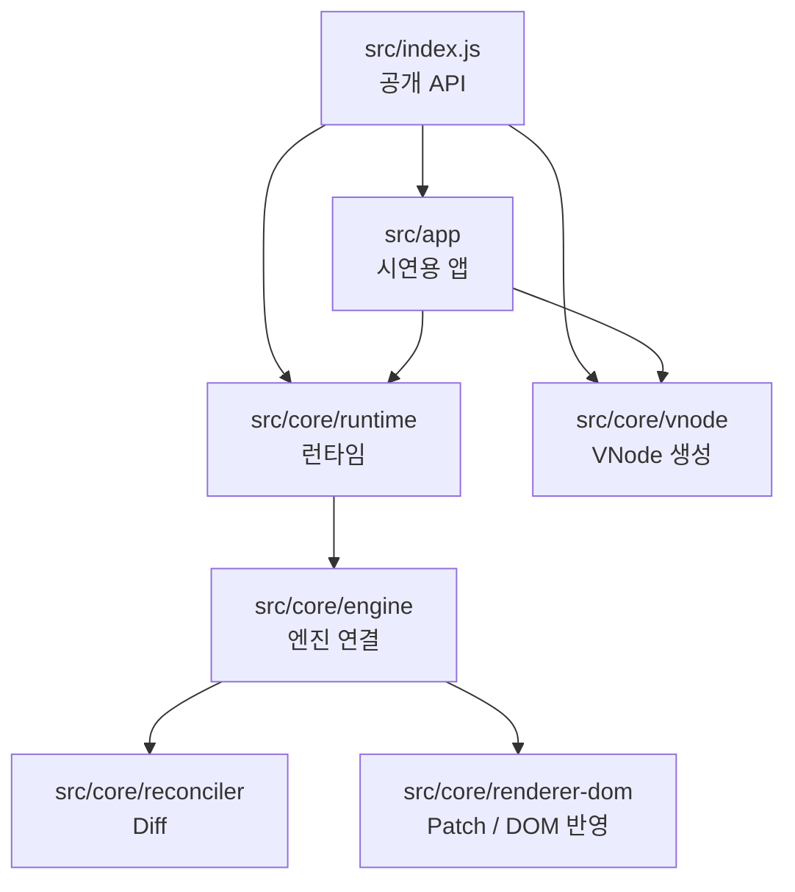
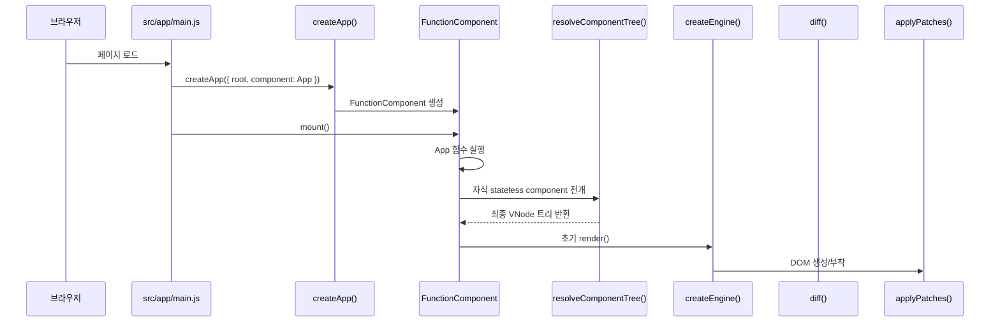

# 시스템 개요

## 1. 이 프로젝트는 무엇인가

이 프로젝트는 `React-like UI 라이브러리`를 직접 구현한 학습용 시스템이다.

정확히 말하면 아래 두 부분으로 구성된다.

- 라이브러리 본체
  - `Virtual DOM`
  - `Diff / Patch`
  - 루트 컴포넌트 런타임
  - `useState`, `useEffect`, `useMemo`
- 시연용 앱
  - 현재는 `카드 컬렉션 쇼케이스` 앱
  - 라이브러리 공개 API만 사용해서 동작한다.

즉, 이 저장소는 “React를 쓰는 앱”이 아니라 “React 비슷한 런타임을 직접 만들고, 그 위에 앱을 올린 저장소”라고 이해하면 된다.

## 2. 왜 이런 구조로 만들었는가

보통 React를 사용할 때는 아래 과정을 직접 보지 않는다.

1. 컴포넌트 함수 실행
2. 상태 저장
3. 화면 구조 생성
4. 이전 화면과 새 화면 비교
5. 정말 바뀐 DOM만 수정
6. effect 실행

이 프로젝트는 그 과정을 직접 구현해서, UI 라이브러리가 내부적으로 어떻게 동작하는지 학습할 수 있게 만든 것이다.

## 3. 큰 구조

전체 구조는 아래처럼 보면 이해가 쉽다.

핵심 포인트는 아래와 같다.

- `src/index.js`는 라이브러리의 정문이다.
- `src/core/runtime`은 상태와 Hook을 관리한다.
- `src/core/vnode`는 화면 설명서를 만든다.
- `src/core/reconciler`는 “무엇이 바뀌었는가”를 계산한다.
- `src/core/renderer-dom`은 실제 DOM을 고친다.
- `src/app`은 이 라이브러리를 사용하는 예시 앱이다.

## 4. 폴더별 역할

### 4.1 공개 API

- [src/index.js](../src/index.js)

이 파일은 외부에서 사용할 API를 모아 export 한다.

예를 들어 앱은 아래만 보면 된다.

- `createApp`
- `FunctionComponent`
- `h`
- `useState`
- `useEffect`
- `useMemo`

즉, 앱은 `src/core/...` 내부 구현을 직접 쓰지 않고, 항상 `src/index.js`만 통해서 라이브러리를 사용해야 한다.

### 4.2 런타임

- [src/core/runtime/FunctionComponent.js](../src/core/runtime/FunctionComponent.js)
- [src/core/runtime/createApp.js](../src/core/runtime/createApp.js)
- [src/core/runtime/scheduleUpdate.js](../src/core/runtime/scheduleUpdate.js)
- [src/core/runtime/commitEffects.js](../src/core/runtime/commitEffects.js)
- [src/core/runtime/unmountComponent.js](../src/core/runtime/unmountComponent.js)

이 계층은 “상태가 바뀌면 언제 다시 렌더할지”를 결정한다.

### 4.3 Hook

- [src/core/runtime/hooks/useState.js](../src/core/runtime/hooks/useState.js)
- [src/core/runtime/hooks/useEffect.js](../src/core/runtime/hooks/useEffect.js)
- [src/core/runtime/hooks/useMemo.js](../src/core/runtime/hooks/useMemo.js)

이 계층은 Hook 호출 순서를 기억하고, 각 Hook이 자신의 슬롯을 유지하도록 만든다.

### 4.4 VNode

- [src/core/vnode/h.js](../src/core/vnode/h.js)
- [src/core/vnode/index.js](../src/core/vnode/index.js)
- [src/core/vnode/normalizeChildren.js](../src/core/vnode/normalizeChildren.js)

이 계층은 “화면 설명서”를 만드는 곳이다.

실제 DOM을 바로 만들지 않고, 먼저 `VNode`라는 중간 표현을 만든다.

### 4.5 Resolver

- [src/core/runtime/resolveComponentTree.js](../src/core/runtime/resolveComponentTree.js)

자식 stateless component를 실제 VNode 트리로 펼치는 역할을 한다.

즉, `h(CardTile, props)` 같은 선언을 실제 `div`, `button`, `img` 같은 일반 VNode로 바꿔준다.

### 4.6 Diff / Patch

- [src/core/reconciler/diff.js](../src/core/reconciler/diff.js)
- [src/core/reconciler/diffChildren.js](../src/core/reconciler/diffChildren.js)
- [src/core/reconciler/diffProps.js](../src/core/reconciler/diffProps.js)
- [src/core/renderer-dom/patch.js](../src/core/renderer-dom/patch.js)
- [src/core/renderer-dom/createDom.js](../src/core/renderer-dom/createDom.js)
- [src/core/renderer-dom/applyProps.js](../src/core/renderer-dom/applyProps.js)
- [src/core/renderer-dom/applyEvents.js](../src/core/renderer-dom/applyEvents.js)

이 계층은 이전 화면과 다음 화면을 비교하고, 실제 DOM에 최소 수정만 반영한다.

### 4.7 앱

- [src/app/App.js](../src/app/App.js)
- [src/app/main.js](../src/app/main.js)
- [src/app/components](../src/app/components)
- [src/app/pages](../src/app/pages)

현재 시연용 앱은 `카드 컬렉션 쇼케이스`다.

이 앱은 하나의 루트 상태를 사용하고, `currentPage`로 여러 페이지처럼 보이는 상태 기반 다중 페이지 SPA를 구현한다.

## 5. 한눈에 보는 실행 흐름

## 6. 이 문서를 읽은 뒤 어디를 보면 좋은가

추천 순서는 아래와 같다.

1. [runtime-walkthrough.md](./runtime-walkthrough.md)
2. [renderer-and-vdom.md](./renderer-and-vdom.md)
3. [app-showcase-guide.md](./app-showcase-guide.md)

이 순서로 보면 “라이브러리 내부”를 먼저 이해하고, 그 다음 “현재 앱이 그 라이브러리를 어떻게 쓰는지”까지 자연스럽게 이어진다.
