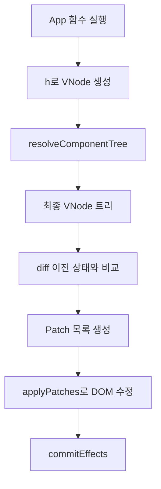

# VDOM, Resolver, Diff, Patch 설명

## 1. 왜 VDOM이 필요한가

화면을 바로 DOM으로 만들면 비교와 업데이트가 어렵다.

그래서 이 시스템은 먼저 “화면 설명서”를 만든다.
이 설명서가 `VNode`다.

예를 들어 아래 코드는:

```js
h("button", { onClick: handleClick }, "Save")
```

대략 이런 구조의 VNode로 바뀐다.

```js
{
  type: "element",
  tag: "button",
  props: {},
  events: { click: handleClick },
  children: [{ type: "text", text: "Save" }],
}
```

즉, VNode는 “지금 화면이 어떻게 생겨야 하는지”를 객체로 표현한 것이다.

## 2. `h()`가 하는 일

파일:

- [src/core/vnode/h.js](../src/core/vnode/h.js)

`h()`는 아래 역할을 한다.

- `key` 분리
- 이벤트 prop 분리
- 일반 props 정리
- children 평탄화
- 최종 element VNode 생성

### 2.1 이벤트는 왜 분리하는가

예를 들어 `onClick`은 일반 DOM 속성이 아니다.
실제 DOM에서는 `addEventListener("click", handler)`로 연결해야 한다.

그래서 `h()`는 `onClick` 같은 값을 `events`에 따로 저장한다.

단, 자식 stateless component에 함수 prop을 넘길 때는 DOM 이벤트로 잘못 빼면 안 된다.
현재 구현은 `tag`가 함수가 아닌 실제 DOM 태그일 때만 DOM 이벤트로 분리한다.

## 3. 자식 컴포넌트는 왜 바로 DOM이 아닌가

예를 들어 아래가 있다고 하자.

```js
h(CardTile, { card, onSelect })
```

브라우저는 `CardTile`이라는 함수를 직접 이해하지 못한다.

그래서 먼저 이 함수를 실행해서, 그 안에서 반환한 일반 VNode 트리로 펼쳐야 한다.

이 작업이 resolver의 역할이다.

## 4. `resolveComponentTree()`의 역할

파일:

- [src/core/runtime/resolveComponentTree.js](../src/core/runtime/resolveComponentTree.js)

이 함수는 아래를 수행한다.

1. 입력 VNode가 text면 그대로 반환
2. 일반 DOM 태그면 자식만 재귀적으로 전개
3. 함수형 자식 컴포넌트면 직접 호출
4. 그 결과를 다시 VNode로 정규화
5. 최종적으로 “함수 태그가 없는 VNode 트리”를 만든다

즉, resolver를 통과한 뒤에는 `div`, `button`, `img`, `text` 같은 일반 노드만 남는다.

```mermaid
flowchart TD
  A[h(CardTile, props)] --> B[resolveComponentTree]
  B --> C[CardTile(props) 실행]
  C --> D[h(article, ...)]
  D --> E[일반 VNode 트리]
```

## 5. Diff는 무엇을 계산하는가

파일:

- [src/core/reconciler/diff.js](../src/core/reconciler/diff.js)
- [src/core/reconciler/diffChildren.js](../src/core/reconciler/diffChildren.js)
- [src/core/reconciler/diffProps.js](../src/core/reconciler/diffProps.js)

Diff는 이전 화면 설명서와 다음 화면 설명서를 비교해서 아래 질문에 답한다.

- 텍스트가 바뀌었는가
- 태그가 바뀌었는가
- props가 바뀌었는가
- 이벤트가 바뀌었는가
- 자식이 추가/삭제/이동했는가

결과는 `Patch[]`다.

예를 들어 다음 같은 patch가 나온다.

- `SET_TEXT`
- `SET_PROP`
- `REMOVE_PROP`
- `INSERT_CHILD`
- `REMOVE_CHILD`
- `MOVE_CHILD`
- `REPLACE_NODE`
- `SET_EVENT`
- `REMOVE_EVENT`

## 6. key는 왜 중요한가

리스트 렌더링에서 `key`는 “이 아이템이 누구인지”를 알려주는 식별자다.

예를 들어 카드 컬렉션에서 정렬 순서가 바뀌더라도 같은 카드라면 key는 같아야 한다.
그러면 diff는 “새 카드가 생긴 것”이 아니라 “기존 카드가 이동한 것”으로 판단할 수 있다.

이렇게 하면 DOM을 덜 망가뜨리고 더 자연스럽게 갱신할 수 있다.

## 7. Patch는 실제 DOM을 어떻게 바꾸는가

파일:

- [src/core/renderer-dom/patch.js](../src/core/renderer-dom/patch.js)
- [src/core/renderer-dom/createDom.js](../src/core/renderer-dom/createDom.js)

Patch 계층은 diff 결과를 실제 DOM 조작으로 바꾼다.

예를 들면:

- `SET_TEXT` → `textContent` 변경
- `SET_PROP` → DOM 속성 반영
- `SET_EVENT` → `addEventListener`
- `INSERT_CHILD` → `insertBefore`
- `REMOVE_CHILD` → `removeChild`

즉, diff가 “무엇을 바꿔야 하는지”를 계산하면,
patch는 “실제로 어떻게 바꿀지”를 실행한다.

## 8. DOM 생성은 언제 일어나는가

초기 mount에서는 [src/core/renderer-dom/createDom.js](../src/core/renderer-dom/createDom.js)가 전체 VNode 트리를 DOM으로 바꾼다.

update 때는 전체를 다시 만들지 않고 patch만 반영한다.

## 9. 이벤트는 어떻게 붙는가

파일:

- [src/core/renderer-dom/applyEvents.js](../src/core/renderer-dom/applyEvents.js)

이 파일은 이벤트를 아래 방식으로 관리한다.

- 이전 이벤트 핸들러가 있으면 제거
- 새 핸들러가 있으면 등록
- 더 이상 없는 이벤트는 제거

즉, 렌더가 다시 일어나도 예전 핸들러가 중복으로 남지 않도록 관리한다.

## 10. props는 어떻게 붙는가

파일:

- [src/core/renderer-dom/applyProps.js](../src/core/renderer-dom/applyProps.js)

여기서는 일반 속성과 DOM 특수 속성을 다르게 다룬다.

예:

- `className`
- `value`
- `checked`
- `selected`
- boolean 속성

이 부분이 중요한 이유는 form control이 단순 문자열 attribute와 다르게 동작하기 때문이다.

## 11. 엔진은 왜 필요한가

파일:

- [src/core/engine/createEngine.js](../src/core/engine/createEngine.js)

엔진은 runtime과 diff/patch 계층을 연결하는 중간 facade다.

엔진이 관리하는 것:

- 현재 VNode
- diff mode
- history
- 마지막 patch 목록
- root DOM 동기화

즉, runtime은 Hook과 상태를 관리하고,
engine은 VDOM과 DOM 반영을 관리한다.

## 12. 전체 데이터 흐름



## 13. 이 문서의 핵심 요약

한 문장으로 정리하면:

> 이 시스템은 화면을 먼저 VNode로 설명하고, resolver로 자식 컴포넌트를 펼친 뒤, diff로 바뀐 점만 계산하고, patch로 DOM에 최소 수정만 적용한다.
