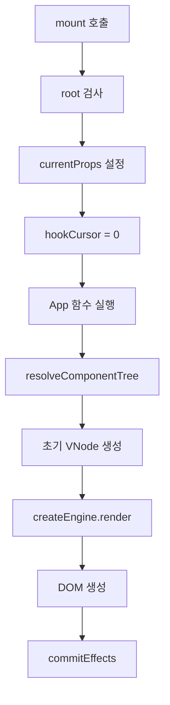
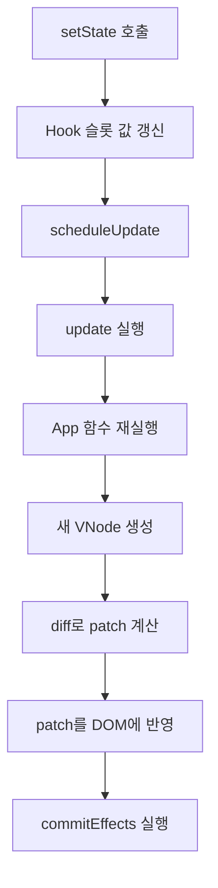

# 런타임 동작 설명

## 1. 런타임이 하는 일

이 시스템에서 런타임은 아래 일을 담당한다.

- 루트 컴포넌트 실행
- Hook 상태 저장
- 상태 변경 시 재렌더 예약
- effect 실행과 cleanup 처리
- unmount 시 정리

쉽게 말하면, 런타임은 “화면을 그리는 관리자”다.

## 2. 시작점: `createApp()`

파일:

- [src/core/runtime/createApp.js](../src/core/runtime/createApp.js)

`createApp()`은 외부에서 가장 먼저 호출하는 진입점이다.

예시는 아래와 비슷하다.

```js
createApp({
  root: document.getElementById("app"),
  component: App,
  batching: "microtask",
}).mount();
```

이 함수가 하는 일은 단순하다.

1. `root`가 올바른 DOM인지 검사
2. `component`가 함수인지 검사
3. 내부적으로 `FunctionComponent` 인스턴스 생성
4. `mount()`, `unmount()`, `updateProps()` 등을 감싼 앱 객체 반환

즉, `createApp()`은 사용자 친화적인 래퍼이고, 실제 핵심은 `FunctionComponent`가 담당한다.

## 3. 핵심 관리자: `FunctionComponent`

파일:

- [src/core/runtime/FunctionComponent.js](../src/core/runtime/FunctionComponent.js)

이 클래스는 루트 컴포넌트를 감싸고 아래 상태를 가진다.

- `hooks`
- `hookCursor`
- `currentProps`
- `currentVNode`
- `rootElement`
- `isMounted`
- `pendingEffects`
- `scheduledUpdate`
- `engine`

### 3.1 왜 `hooks` 배열이 필요한가

Hook은 이름으로 저장되지 않는다.

예를 들어 아래 코드가 있다고 하자.

```js
const [count, setCount] = useState(0);
const [query, setQuery] = useState("");
const result = useMemo(...);
```

이 시스템은 이를 대략 아래처럼 기억한다.

- 0번 슬롯: `useState(0)`
- 1번 슬롯: `useState("")`
- 2번 슬롯: `useMemo(...)`

즉, Hook은 “호출 순서”로 구분된다.

그래서 렌더마다 Hook 호출 순서가 바뀌면 안 된다.

## 4. mount 시 무슨 일이 일어나는가

`mount()`는 첫 렌더를 담당한다.

흐름은 아래와 같다.



### 4.1 `performRender()`의 의미

`FunctionComponent` 안의 `performRender()`는 실제 렌더를 준비하는 내부 메서드다.

여기서 하는 일:

- 현재 props 저장
- `hookCursor = 0`으로 초기화
- 현재 컴포넌트를 dispatcher에 등록
- 루트 `renderFn` 실행
- 반환된 VNode를 resolver에 통과시킴
- Hook 개수 검증

## 5. update 시 무슨 일이 일어나는가

상태가 바뀌면 `update()`가 호출된다.



### 5.1 왜 전체 DOM을 다시 만들지 않는가

이 시스템은 상태가 바뀌어도 전체 DOM을 통째로 지우지 않는다.

대신 아래를 한다.

1. 이전 VNode 보관
2. 새 VNode 생성
3. 둘을 비교
4. 정말 바뀐 부분만 patch로 계산
5. patch만 실제 DOM에 반영

이것이 `Virtual DOM + Diff + Patch` 흐름이다.

## 6. `useState` 내부 동작

파일:

- [src/core/runtime/hooks/useState.js](../src/core/runtime/hooks/useState.js)

### 6.1 첫 렌더

첫 렌더에서 슬롯이 없으면 새 슬롯을 만든다.

슬롯 구조는 대략 아래와 같다.

```js
{
  kind: "state",
  value: initialValue,
  setter: function,
}
```

### 6.2 setter가 하는 일

setter는 아래를 수행한다.

1. 이미 unmount 됐으면 no-op
2. 다음 값을 계산
3. 이전 값과 같으면 종료
4. 다르면 슬롯 값 변경
5. `scheduleUpdate(component)` 호출

즉, setter는 DOM을 직접 수정하지 않는다.
렌더 예약만 한다.

## 7. `useEffect` 내부 동작

파일:

- [src/core/runtime/hooks/useEffect.js](../src/core/runtime/hooks/useEffect.js)
- [src/core/runtime/commitEffects.js](../src/core/runtime/commitEffects.js)

핵심 원칙은 아래다.

- effect는 렌더 함수 안에서 바로 실행하지 않는다.
- DOM patch가 끝난 뒤 실행한다.
- 이전 cleanup이 있으면 새 effect 전에 먼저 실행한다.

### 7.1 effect 단계

1. 렌더 중에는 “이번에 실행해야 할 effect 인덱스”만 기록
2. DOM 반영 완료
3. `commitEffects()` 호출
4. 이전 cleanup 실행
5. 새 effect 실행
6. 반환값이 함수면 cleanup으로 저장

## 8. `useMemo` 내부 동작

파일:

- [src/core/runtime/hooks/useMemo.js](../src/core/runtime/hooks/useMemo.js)
- [src/core/runtime/areHookDepsEqual.js](../src/core/runtime/areHookDepsEqual.js)

`useMemo`는 “값 재사용”이 목적이다.

예를 들어 카드 목록 검색/정렬 결과 같은 파생 데이터를 계속 다시 계산하면 낭비가 생긴다.
그래서 의존성이 같으면 이전 값을 그대로 재사용한다.

## 9. dispatcher가 왜 필요한가

관련 파일:

- [src/core/runtime/currentDispatcher.js](../src/core/runtime/currentDispatcher.js)
- [src/core/runtime/assertActiveDispatcher.js](../src/core/runtime/assertActiveDispatcher.js)
- [src/core/runtime/assertRootOnlyHookUsage.js](../src/core/runtime/assertRootOnlyHookUsage.js)

Hook이 “지금 어떤 루트 컴포넌트의 몇 번째 슬롯을 쓰고 있는지” 알기 위해 dispatcher가 필요하다.

쉽게 말해 dispatcher는 “현재 렌더 중인 주인 컴포넌트”를 가리키는 포인터다.

이 시스템은 아래 규칙을 강제한다.

- Hook은 루트 컴포넌트에서만 사용
- 자식 stateless component에서는 Hook 금지
- Hook 호출 순서가 바뀌면 오류

## 10. update 예약: `scheduleUpdate()`

파일:

- [src/core/runtime/scheduleUpdate.js](../src/core/runtime/scheduleUpdate.js)

이 함수는 상태 변경이 일어났을 때 “언제 다시 렌더할지”를 정한다.

지원 모드:

- `sync`
- `microtask`

### 10.1 `sync`

`setState`가 호출되면 바로 `update()`를 실행한다.

### 10.2 `microtask`

같은 tick 안에서 여러 번 상태가 바뀌면 한 번으로 합쳐서 렌더할 수 있다.

즉, 약한 형태의 batching이다.

## 11. unmount 시 무슨 일이 일어나는가

파일:

- [src/core/runtime/unmountComponent.js](../src/core/runtime/unmountComponent.js)

unmount는 단순히 DOM만 지우는 것이 아니다.

해야 할 일:

1. 예약된 update 취소
2. effect cleanup 실행
3. DOM 정리
4. dispatcher와 내부 참조 정리
5. 이후 setter가 다시 동작하지 않도록 막기

## 12. 런타임 핵심 요약

한 줄로 요약하면 아래와 같다.

> `FunctionComponent`가 Hook 상태를 슬롯 배열로 들고 있고, 상태가 바뀌면 새 VNode를 계산해 diff/patch로 DOM을 최소 수정한 뒤, 마지막에 effect를 commit 한다.

이 흐름을 이해하면 나머지 코드도 훨씬 읽기 쉬워진다.
